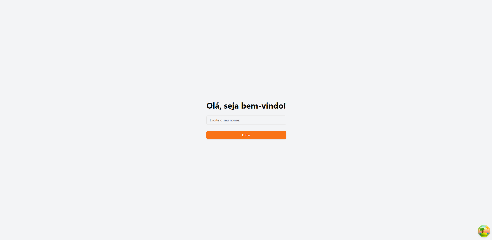
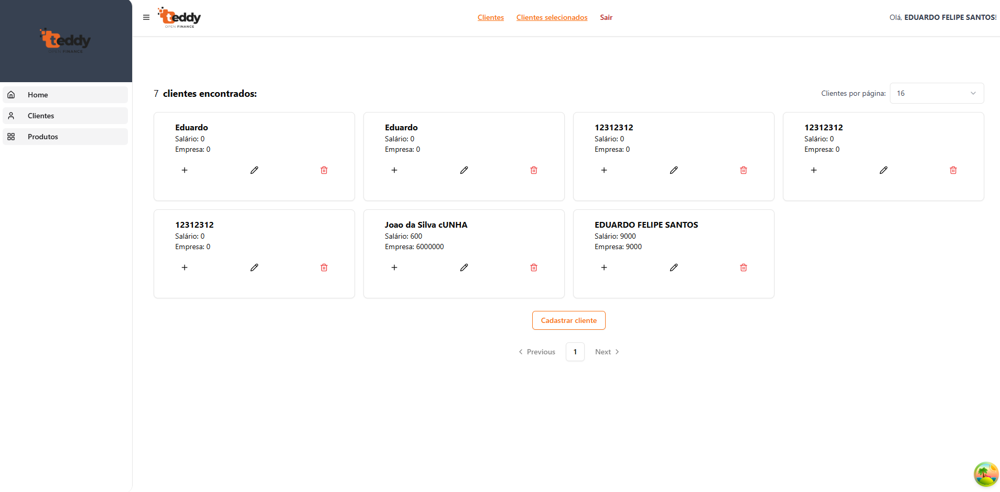

# Painel Administrativo

Tela de login


---

Tela clientes


## Visão Geral

Este projeto é um painel administrativo para gerenciar clientes. Ele permite:

- Inserir um nome e acessar a lista de clientes cadastrados.
- Criar, visualizar, atualizar e excluir clientes.
- Visualizar detalhes dos clientes selecionados.

## Tecnologias Utilizadas

### Front-End:

- React + Vite
- TypeScript
- TailwindCSS (para estilização)
- ShadCN (componentes)
- Testes end-to-end (NÃO IMPLEMENTADO - AINDA)

### Back-End:

- NestJS
- CQRS
- TypeORM + PostgreSQL
- Swagger para documentação
- Observabilidade com ferramentas apropriadas(NÃO IMPLEMENTADO - AINDA)
- Testes unitários
- BullMQ para escalabilidade

### Gerais:

- Docker e Docker Compose para facilitar a execução
- AWS para infraestrutura
- Deploy das aplicações
- Arquitetura desenhada considerando escalabilidade
- Gravação de vídeo demonstrativo

## Tempo Estimado de Desenvolvimento

### Tempo total: **2 a 5 semanas (1 - 2 Sprints)**, considerando os diferenciais.

- **Semana 1:** Configuração inicial (Boilerplate), setup de tecnologias, definição da arquitetura.
- **Semana 2:** Desenvolvimento do CRUD no backend e frontend.
- **Semana 3:** Melhorias no front, integração com AWS, testes unitários.
- **Semana 4:** Implementação de diferenciais como observabilidade, mensageria e testes e2e.
- **Semana 5:** Ajustes finais, otimizações e Deploy e validações finais.

## Equipe Necessária

**2 a 3 desenvolvedores**

- 1 **Desenvolvedor Full Stack Sênior** (para arquitetura, integrações e decisões técnicas críticas)
- 1 **Desenvolvedor Front-End Pleno ou Sênior** (para desenvolvimento do painel e testes)
- 1 **Desenvolvedor Back-End Pleno ou Sênior** (para regras de negócio, API, banco de dados e mensageria)

## Rodando o Projeto - Front End

### Pré-requisitos:

- Node.js (versão recente)
- pnpm ou yarn (gerenciador de pacotes)
- Navegador atualizado para acessar a aplicação
- Editor de código (recomendado: Visual Studio Code)
- Extensão do VS Code para ESLint (opcional, mas recomendado)

### Passos :

1. Clone este repositório:
   ```sh
   git clone https://github.com/edufsantos/teddy-front-end
   ```
2. Acesse a pasta do projeto:
   ```sh
   cd teddy-front-end
   ```
3. Suba o projeto na porta 5173
   ```sh
   pnpm run dev
   ```
4. Acesse o frontend em `http://localhost:5173`

## Melhorias Futuras

- Implementação de testes E2E
- Criação de permissões usando a lib CASL
- Implementação de biblioteca de internacionalização como I18n

## Contato

Caso tenha dúvidas ou sugestões, entre em contato pelo e-mail: `eduardosantosifms@gmail.com`.
